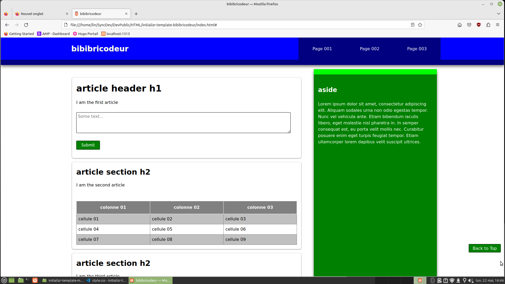

# initializr template bibibricodeur

Suite à la mise à disposition du template [initializr-template](https://github.com/verekia/initializr-template) dans le domaine public, je me suis amusé à en refaire un à ma sauce pour me rappeler les bases CSS.

## Installation

## Usage

## Contributing
[makeareadme](https://www.makeareadme.com/)

## License
[Unlicense](https://choosealicense.com/licenses/unlicense/)
